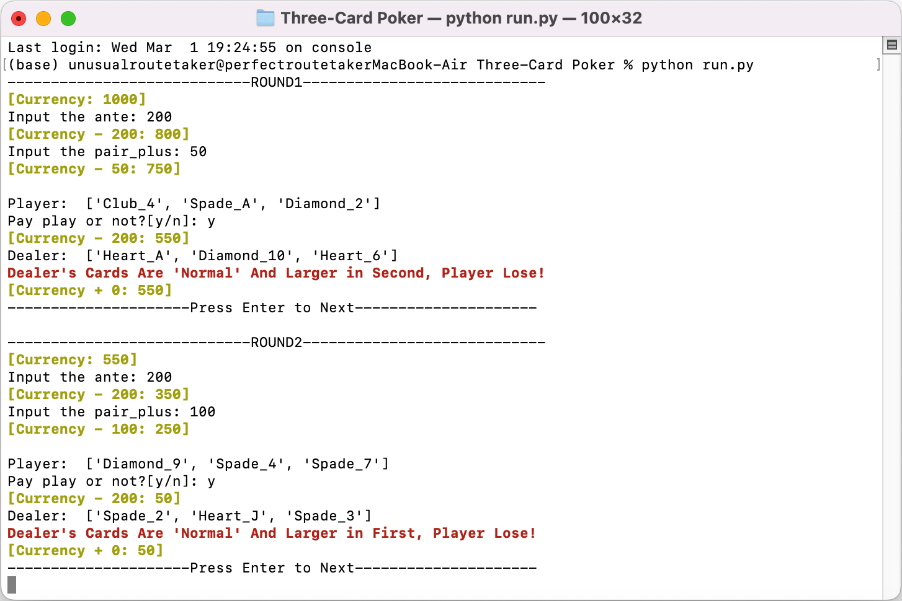

# Three-Card Poker Common Line Beta Edition

## Remending

This is an esaying game script follow the Casino game in GTA OL.

## Screen Capture

## Rule

### Magnitude: 

​		A, K, Q, J, 10, 9, 8, 7, 6, 5, 4, 3

### Suit:

​		Diamond

​		Heart

​		Spade

​		Club

### Combinatoin examples:

​		**Normal:** [Diamond_3, Diamond_5, Club_6]

​		**Pair:** [Diamond_3, Heart_3, Club_6]

​		**Flush:** [Diamond_3, Diamond_5, Diamond_6]

​		**Stragiht:** [Diamond_3, Diamond_4, Club_5]

​		**Three of A Kind:** [Diamond_3, Heart_3, Club_3]

​		**Stragiht Flush:** [Diamond_3, Diamond_4, Diamond_5]

### Pay

​		Pay play should equal to ante if decide to play.

​		Game will stop when Player loses all currency.

## Odds

### Pair Plus Pays

​		**Pair:** 1 to 1

​		**Flush:** 4 to 1

​		**Stragiht:** 6 to 1

​		**Three of A Kind:** 30 to 1

​		**Stragiht Flush:** 40 to 1

### Ante Bonus Pays

​		**Stragiht:** 1 to 1

​		**Three of A Kind:** 4 to 1

​		**Stragiht Flush:** 5 to 1

